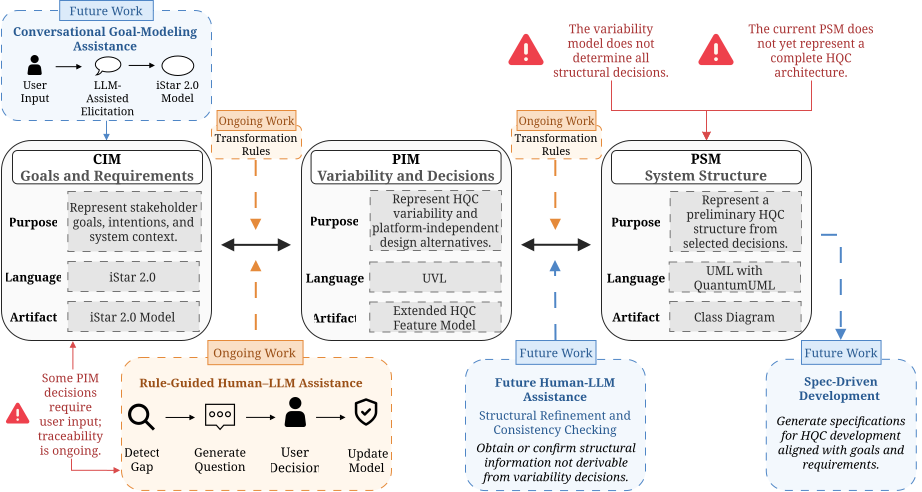

<div align="center">
  
  <p>
    <hr>
    <a href="https://fastapi.tiangolo.com"></a>
    <a href="https://python.org"></a>
    <a href="https://react.dev"></a>
    <a href="https://developer.mozilla.org/en-US/docs/Web/JavaScript"></a>
    <a href="https://www.docker.com"></a>
  </p>
  <p>
    <a href="#need-and-motivation">Need and Motivation</a> ·
    <a href="#transformation-pipeline">Transformation Pipeline</a> ·
    <a href="#system-features">System Features</a> ·
    <a href="#setup">Setup</a> ·
    <a href="#illustrative-cases">Illustrative Cases</a> ·
    <a href="#reproducibility">Reproducibility</a> ·
    <a href="#screenshots">Screenshots</a>
  </p>
</div>

<p align="center">
  <a href="http://200.13.5.22:3000/"><strong><font size="7">Open the Editor</font></strong></a>
</p>

> **Version:** v1.4.1<br>
> **Status:** Research Prototype<br>
> **Research:** MDD-HQC-related works were accepted at CLEI TLISC 2026, the IEEE Quantum Week Q-SET 2026 Workshop, and the JCC 2026 QCQSE-Chile Workshop.

**MDD-HQC** is a model-driven platform for supporting the design of hybrid quantum-classical systems. It provides a partially traceable transformation flow from **iStar 2.0** goal models to variability models written in **UVL** and preliminary **UML class diagrams** enriched with **QuantumUML** stereotypes. The platform also incorporates experimental human-in-the-loop assistance that combines LLM-based analysis with user decisions during model refinement.

---

### Need and Motivation

**Hybrid quantum-classical (HQC) systems** combine classical and quantum components according to the needs and constraints of the system. Their development involves more than selecting a quantum algorithm: engineers must determine **whether**, **where**, and **how** quantum components should be incorporated, considering algorithms, integration mechanisms, programming frameworks, providers, and hardware constraints.

These decisions depend heavily on **specialized knowledge** and are often weakly connected to the original stakeholder goals and requirements. **MDD-HQC** addresses this problem by providing a systematic modeling workflow from stakeholder goals to a preliminary system structure, while maintaining **partial vertical traceability** across its modeling levels.

---

### Transformation Pipeline

MDD-HQC organizes HQC design into three connected modeling levels:

1. **CIM:** Stakeholder goals, needs, and dependencies represented with iStar 2.0.
2. **PIM:** HQC variability, design alternatives, and constraints represented in UVL.
3. **PSM:** A preliminary system structure represented through UML and QuantumUML.

Explicit deterministic rules transform models from CIM to PIM and from PIM to PSM. The workflow also considers semi-automated **human-in-the-loop** assistance at both transformation stages, combining LLM-based analysis with user decisions. The current rules preserve partial vertical traceability for some generated elements.

<p align="center">
  <a href="docs/images/mdd-hqc-overview.svg">
    
  </a>
</p>

> [!NOTE]
> In v1.4.1, LLM support is limited to PIM completeness analysis. Detected gaps trigger predefined questions and alternatives, but user decisions are not automatically incorporated or traced. PSM refinement is currently manual, and the resulting class diagram represents a preliminary system structure rather than a complete HQC software architecture.

---

### System Features

The following table summarizes the main capabilities included in or envisioned for MDD-HQC.

> Status legend: ⬤ implemented, ◐ partial, ◯ not implemented.

| Capability                                                 | Status |
| ---------------------------------------------------------- | ------ |
| Goal-oriented modeling of HQC requirements                 | ⬤      |
| Interview-based elicitation for CIM modeling               | ◯      |
| CIM model generation and interactive refinement            | ◯      |
| Rule-based CIM-to-PIM transformation                       | ◐      |
| Rule-based PIM-to-PSM transformation                       | ◐      |
| Bidirectional or multi-entry transformation flow           | ◯      |
| Variability modeling for HQC design decisions              | ⬤      |
| Vertical traceability across modeling levels               | ◐      |
| Assessment of semantic preservation across transformations | ◯      |
| LLM-assisted PIM completeness analysis                     | ◐      |
| Automatic incorporation of user refinement decisions       | ◯      |
| LLM-assisted PSM structural refinement                     | ◯      |
| Architecture-to-code generation                            | ◯      |
| Project analysis from local folders or GitHub repositories | ◯      |

---

### Setup

The following tools must be installed before running the platform:

* Docker (version 20.10 or higher)
* Docker Compose (version 2.0 or higher)
* Git (for cloning the repository)

> [!NOTE]
> MDD-HQC is designed to run in a **containerized environment** using **Docker Compose**, simplifying dependency management and deployment across different systems.

#### Using Docker Compose

1. **Clone the repository:**

   ```bash
   git clone https://github.com/QuantumLab-DCI/MDD-HQC.git
   cd MDD-HQC
   ```

2. **Create the backend environment file at the repository root:**

   ```bash
   cp .env.example .env
   ```

3. **Create the frontend environment file:**

   ```bash
   cp mdd-hqc-frontend/.env.example mdd-hqc-frontend/.env
   ```

   > The backend reads its configuration from the root `.env` file. The React frontend reads variables prefixed with `REACT_APP_` from `mdd-hqc-frontend/.env`.

4. **Build the images and start the services:**

   ```bash
   docker compose up --build
   ```

   This command builds the backend and frontend images and starts both services.

5. **Access the application:**

   * **Frontend:** http://localhost:3000
   * **Backend API:** http://localhost:8000
   * **API Documentation (Swagger):** http://localhost:8000/docs

6. **Stop the services:**

   ```bash
   docker compose down
   ```

> [!NOTE]
> The deterministic transformations can be executed without enabling the LLM-assisted analysis. To use this experimental functionality, configure a supported provider and the corresponding credentials in the root `.env` file. The default configuration uses the `openrouter/free` alias with a temperature of `0.0`. This alias does not guarantee a fixed underlying model, and the specific model selected by OpenRouter is not currently recorded by the prototype.

> [!CAUTION]
> Ensure that ports 3000 and 8000 are available before starting the containers. If either port is already in use, its mapping can be changed in the `docker-compose.yml` file.

---

### Illustrative Cases

The following cases demonstrate how MDD-HQC represents different hybrid quantum-classical design scenarios from stakeholder goals and system responsibilities.

<table>
  <tr>
    <td width="45%" align="center" valign="middle">
      <a href="mdd-hqc-frontend/public/images/ChileEsPres.svg">
        
      </a>
    </td>
    <td width="55%" valign="middle">
      <h4>ChileEsPres</h4>
      <p>A route-planning scenario that integrates quantum annealing to improve delivery decisions under resource and quality constraints.</p>
    </td>
  </tr>
  <tr>
    <td width="45%" align="center" valign="middle">
      <a href="mdd-hqc-frontend/public/images/Q-TradeX.svg">
        
      </a>
    </td>
    <td width="55%" valign="middle">
      <h4>Q-TradeX</h4>
      <p>A hybrid prediction scenario comparing classical logistic regression with a variational quantum classifier implemented using Qiskit.</p>
    </td>
  </tr>
</table>

---

### Reproducibility

The repository includes the input models and resulting artifacts for the **ChileEsPres** and **Q-TradeX** illustrative cases. The source CIM models can also be loaded directly from the **Examples** section of the user interface.

The generated PIM and PSM artifacts are preserved under `artifacts/cases/`. For Q-TradeX, the repository additionally includes manually refined PIM and PSM models derived from the initial outputs produced by the deterministic transformation rules. These refined models are reference artifacts and are not automatically generated by the current prototype.

Detailed instructions for executing the transformations, accessing the generated outputs, and reproducing the manual refinement workflow are available in [`docs/reproducibility.md`](docs/reproducibility.md).

---

### Screenshots

<table>
  <tr>
    <td width="50%" align="center">
      
      <br>
      <sub>Main interface</sub>
    </td>
    <td width="50%" align="center">
      
      <br>
      <sub>Built-in example catalog</sub>
    </td>
  </tr>
  <tr>
    <td width="50%" align="center">
      
      <br>
      <sub>Preparing guided questions</sub>
    </td>
    <td width="50%" align="center">
      
      <br>
      <sub>LLM-assisted guided interaction</sub>
    </td>
  </tr>
  <tr>
    <td width="50%" align="center">
      
      <br>
      <sub>Prototype visualization of proposed UVL integration</sub>
    </td>
    <td width="50%" align="center">
      
      <br>
      <sub>Transformation workflow</sub>
    </td>
  </tr>
  <tr>
    <td width="50%" align="center">
      
      <br>
      <sub>Enlarged CIM goal model</sub>
    </td>
    <td width="50%" align="center">
      
      <br>
      <sub>Enlarged UVL variability model</sub>
    </td>
  </tr>
  <tr>
    <td width="50%" align="center">
      
      <br>
      <sub>Enlarged preliminary PSM class diagram</sub>
    </td>
    <td width="50%" align="center"></td>
  </tr>
</table>

---

### Home Landing

<p align="center">
  
</p>
